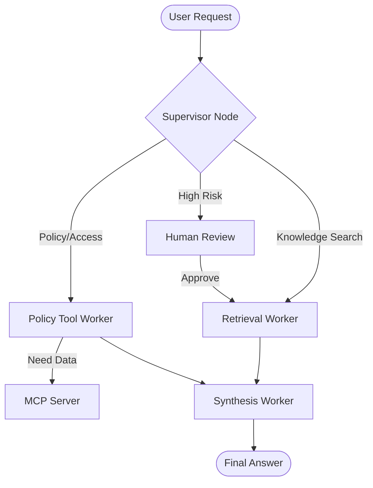

# System Architecture — Lab Day 09

**Nhóm:** D1-C401
**Ngày:** 14/04/2026
**Version:** 1.0

---

## 1. Tổng quan kiến trúc

> Mô tả ngắn hệ thống của nhóm: chọn pattern gì, gồm những thành phần nào.

**Pattern đã chọn:** Supervisor-Worker  
**Lý do chọn pattern này (thay vì single agent):**
Hệ thống Multi-Agent cho phép chia nhỏ các trách nhiệm chuyên biệt. Trong khi Single-Agent (Day 08) dễ bị quá tải khi phải xử lý đồng thời cả việc tìm kiếm văn bản và thực thi các quy tắc chính sách phức tạp, thì mô hình Supervisor-Worker giúp tách biệt logic điều hướng (routing) và thực thi (execution). Điều này giúp tăng độ chính xác, dễ dàng kiểm soát rủi ro thông qua HITL và linh hoạt hơn khi cần tích hợp thêm các công cụ bên ngoài qua MCP.

---

## 2. Sơ đồ Pipeline

> Vẽ sơ đồ pipeline dưới dạng text, Mermaid diagram, hoặc ASCII art.
> Yêu cầu tối thiểu: thể hiện rõ luồng từ input → supervisor → workers → output.

**Ví dụ (ASCII art):**
```
User Request
     │
     ▼
┌──────────────┐
│  Supervisor  │  ← route_reason, risk_high, needs_tool
└──────┬───────┘
       │
   [route_decision]
       │
  ┌────┴────────────────────┐
  │                         │
  ▼                         ▼
Retrieval Worker     Policy Tool Worker
  (evidence)           (policy check + MCP)
  │                         │
  └─────────┬───────────────┘
            │
            ▼
      Synthesis Worker
        (answer + cite)
            │
            ▼
         Output
```

**Sơ đồ thực tế của nhóm:**



---

## 3. Vai trò từng thành phần

### Supervisor (`graph.py`)

| Thuộc tính | Mô tả |
|-----------|-------|
| **Nhiệm vụ** | Phân tích yêu cầu, gán nhãn rủi ro và điều hướng task cho Worker phù hợp. |
| **Input** | Câu hỏi của người dùng (task) |
| **Output** | supervisor_route, route_reason, risk_high, needs_tool |
| **Routing logic** | Kết hợp phân tích từ khóa chuyên sâu và LLM classification. |
| **HITL condition** | Kích hoạt khi phát hiện mã lỗi lạ (ERR-XXX) hoặc truy cập khẩn cấp. |

### Retrieval Worker (`workers/retrieval.py`)

| Thuộc tính | Mô tả |
|-----------|-------|
| **Nhiệm vụ** | Tìm kiếm thông tin liên quan từ cơ sở dữ liệu vector ChromaDB. |
| **Embedding model** | Sentence Transformers (all-MiniLM-L6-v2) |
| **Top-k** | 3 (Mặc định) |
| **Stateless?** | Yes |

### Policy Tool Worker (`workers/policy_tool.py`)

| Thuộc tính | Mô tả |
|-----------|-------|
| **Nhiệm vụ** | Kiểm tra các quy tắc ngoại lệ của chính sách và gọi Tool MCP. |
| **MCP tools gọi** | search_kb, get_ticket_info, check_access_permission |
| **Exception cases xử lý** | Đơn hàng Flash Sale, Sản phẩm kỹ thuật số, Cấp quyền Level 3. |

### Synthesis Worker (`workers/synthesis.py`)

| Thuộc tính | Mô tả |
|-----------|-------|
| **LLM model** | gpt-4o / gpt-3.5-turbo |
| **Temperature** | 0.0 |
| **Grounding strategy** | Chỉ trả lời dựa trên context được cung cấp và trích dẫn nguồn. |
| **Abstain condition** | Khi context rỗng hoặc không liên quan đến câu hỏi. |

### MCP Server (`mcp_server.py`)

| Tool | Input | Output |
|------|-------|--------|
| search_kb | query, top_k | chunks, sources |
| get_ticket_info | ticket_id | ticket details (status, owner, priority) |
| check_access_permission | access_level, role | can_grant, approver_list |
| dispatch_tool | tool_name, tool_input | tool execution result |

---

## 4. Shared State Schema

> Liệt kê các fields trong AgentState và ý nghĩa của từng field.

| Field | Type | Mô tả | Ai đọc/ghi |
|-------|------|-------|-----------|
| task | str | Câu hỏi đầu vào | supervisor đọc |
| supervisor_route | str | Worker được chọn | supervisor ghi |
| route_reason | str | Lý do route | supervisor ghi |
| retrieved_chunks | list | Evidence từ retrieval | retrieval ghi, synthesis đọc |
| policy_result | dict | Kết quả kiểm tra policy | policy_tool ghi, synthesis đọc |
| mcp_tools_used | list | Tool calls đã thực hiện | policy_tool ghi |
| final_answer | str | Câu trả lời cuối | synthesis ghi |
| confidence | float | Mức tin cậy | synthesis ghi |
| latency_ms | int | Thời gian thực thi | Graph ghi |

---

## 5. Lý do chọn Supervisor-Worker so với Single Agent (Day 08)

| Tiêu chí | Single Agent (Day 08) | Supervisor-Worker (Day 09) |
|----------|----------------------|--------------------------|
| Debug khi sai | Khó — không rõ lỗi ở đâu | Dễ hơn — test từng worker độc lập |
| Thêm capability mới | Phải sửa toàn prompt | Thêm worker/MCP tool riêng |
| Routing visibility | Không có | Có route_reason trong trace |
| Xử lý ngoại lệ | Dễ nhầm lẫn | Chính xác nhờ Worker chuyên biệt |

**Nhóm điền thêm quan sát từ thực tế lab:**
Trong quá trình chạy lab, nhóm nhận thấy khi gặp các câu hỏi lắt léo về "Flash Sale", hệ thống Multi-Agent không bị "ảo tưởng" (hallucination) như Single-Agent vì Policy Worker được nạp trực tiếp bộ quy tắc ngoại lệ để kiểm tra trước khi Synthesis.

---

## 6. Giới hạn và điểm cần cải tiến

> Nhóm mô tả những điểm hạn chế của kiến trúc hiện tại.

1. Tốc độ phản hồi (latency) còn cao do phải trải qua nhiều bước trung gian và nạp mô hình.
2. Việc chia sẻ State qua Dictionary đơn giản có thể gây lỗi nếu nhiều Worker ghi đè dữ liệu của nhau (cần cơ chế khóa hoặc merge state).
3. Hệ thống chưa có khả năng tự sửa lỗi (Self-correction) nếu Supervisor chọn sai route lần đầu.
