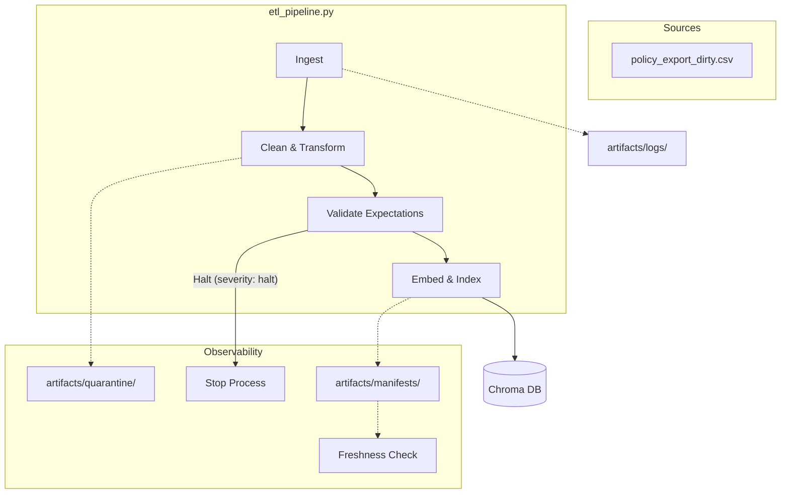

# Kiến trúc pipeline — Lab Day 10

**Nhóm:** D1
**Cập nhật:** 15/04/2026

---

## 1. Sơ đồ luồng (bắt buộc có 1 diagram: Mermaid / ASCII)

---

## 2. Ranh giới trách nhiệm

| Thành phần | Input | Output | Owner nhóm |
|------------|-------|--------|--------------|
| Ingest | CSV Raw | DataFrame / Dict List | Ingestion Owner |
| Transform | Raw Rows | Cleaned Rows | Cleaning Owner |
| Quality | Cleaned Rows | Result + Halt flag | Quality Owner |
| Embed | Validated Rows | Chroma Collection | Embed Owner |
| Monitor | Manifest JSON | SLA Report | Monitoring Owner |

---

## 3. Idempotency & rerun

- **Strategy:** Sử dụng `_stable_chunk_id` bản chất là SHA-256 hash của `doc_id` + `chunk_text` + `sequence`.
- **Rerun:** Khi chạy lại, ChromaDB thực hiện **upsert** dựa trên ID này. Nếu nội dung không đổi, vector không bị duplicate. Pipeline cũng thực hiện **pruning** (xoá các ID cũ không còn trong bản cleaned mới nhất) để đảm bảo vector store khớp 100% với dữ liệu đã publish.

---

## 4. Liên hệ Day 09

- Pipeline này đóng vai trò là "Data Engine" cung cấp corpus sạch cho các Agent (Supervisor/Worker) trong Day 09.
- Dữ liệu được đẩy vào cùng một Chroma collection mà Agent sử dụng để retrieval, giúp Agent luôn có thông tin policy mới nhất (ví dụ: window refund 7 ngày thay vì 14 ngày).

---

## 5. Rủi ro đã biết

- **Chroma Storage:** Lỗi Disk I/O trên một số môi trường (đã ghi nhận trong quality report).
- **Format Drift:** Nếu format CSV nguồn thay đổi đột ngột (thêm cột, đổi tên), pipeline cần cập nhật schema mapping.
- **Mojibake:** Các ký tự lạ ngoài bảng mã chuẩn có thể sót nếu rules chưa bao phủ hết.

